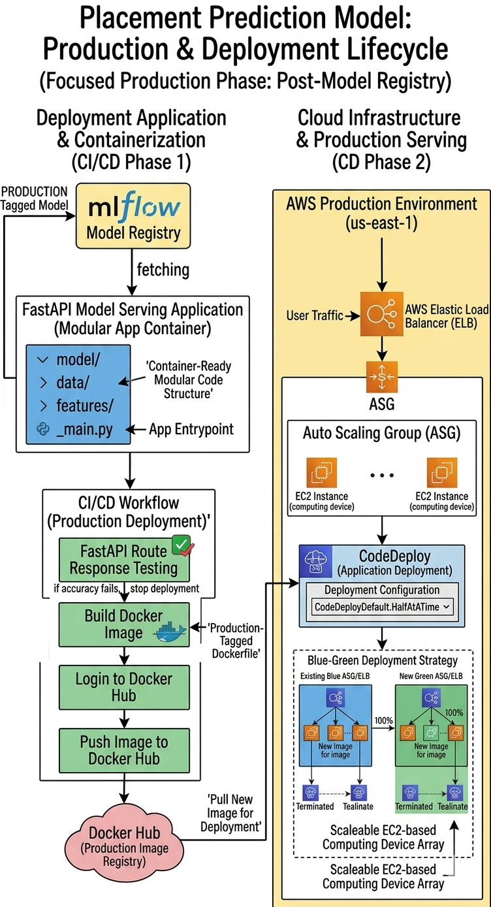

# Placement Prediction Model - Deployment & Production Stage


This repository manages the **Production Lifecycle** of the Placement Prediction Model. It focuses on taking the "Production-Ready" model registered in the development phase and serving it as a highly available, scalable web service using **FastAPI**, **Docker**, and **AWS**.

---

## 🏗️ Deployment Architecture
The following diagram illustrates the production architecture, including the CI/CD containerization flow and the cloud infrastructure setup on AWS using a Blue-Green deployment strategy.



---

## 🚀 Production Workflow

### 1. Model Serving with FastAPI
* **Dynamic Fetching:** The application is built using **FastAPI**. Instead of hardcoding model files, the service dynamically fetches the latest version of the model tagged `Production` from the **MLflow Model Registry** (hosted on Dagshub).
* **Modular Wrapper:** The `src/` code from the development stage is reused here to ensure that the preprocessing logic used during inference exactly matches the logic used during training.

### 2. Containerization (CI/CD Phase 1)
* **Dockerization:** We use a lightweight Python base image to containerize the FastAPI application.
* **Automated CI Pipeline:** Upon a code push, GitHub Actions:
    * Executes **Route Testing** to ensure the API endpoints (`/predict`, `/health`) are responding correctly.
    * Builds a new **Docker Image**.
    * Authenticates and pushes the image to **Docker Hub** with a unique version tag.

### 3. Cloud Infrastructure (CD Phase 2)
The infrastructure is hosted on **AWS** to ensure high availability and scalability:
* **Computing:** Uses **EC2 Instances** organized within an **Auto Scaling Group (ASG)** to handle varying traffic loads.
* **Traffic Management:** An **AWS Elastic Load Balancer (ELB)** sits in front of the instances to distribute user requests evenly.

### 4. Blue-Green Deployment Strategy
To achieve zero-downtime updates, we utilize **AWS CodeDeploy** with a **Blue-Green** strategy:
* **Strategy:** `CodeDeployDefault.HalfAtATime`.
* **Process:** A new "Green" fleet of instances is launched with the latest Docker image. Once health checks pass, traffic is shifted from the "Blue" (old) fleet to the "Green" fleet.
* **Rollback:** If any issues are detected during the shift, traffic is immediately rerouted back to the stable Blue environment.

---

## 📂 Repository Structure
```text
.
├── .github/workflows/   <- Deployment CI/CD (Build, Test, Push to Docker)
├── app.py               <- FastAPI entrypoint and  Route definitions and schemas
├── scripts/             <- Deployment scripts for AWS CodeDeploy (AppSpec)
├── Dockerfile           <- Production container configuration
├── appspec.yml          <- AWS CodeDeploy configuration file
└── requirements.txt     <- Production-specific dependencies

```
## 🛠️ Tech Stack
Framework: FastAPI

* **Containerization**: Docker & Docker Hub

* **Registry**: MLflow (Model Registry)

* **Cloud Platform**: AWS (EC2, ASG, ELB)

* **Deployment Tool**: AWS CodeDeploy

* **CI/CD**: GitHub Actions

## 🔗 Development Source
This deployment repository relies on the models and modular pipelines produced in the development stage. For details on data versioning, training pipelines, and experiment tracking, visit the primary repository:

👉 Development & Training Repository
[](https://github.com/umiii-786/placement-prediction-Model/)

Developed as part of the Final Year Project (FYP).